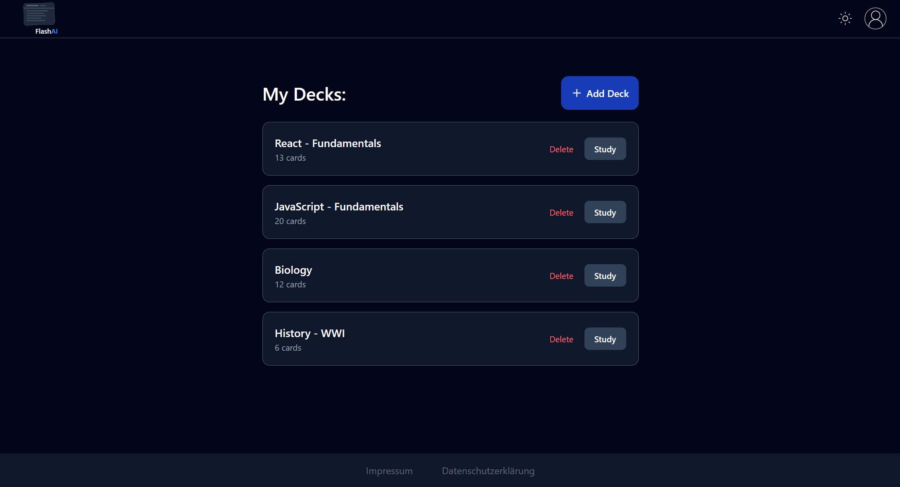
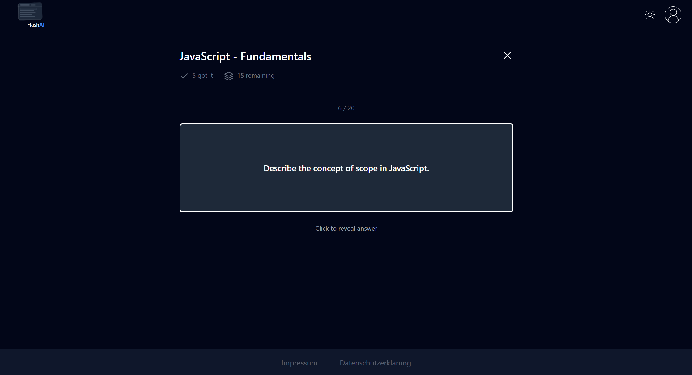

# FlashAI

AI-powered flashcard generator. Paste your notes or upload a PDF - FlashAI generates study-ready flashcards in seconds.


**[Live Demo](https://getflashai.vercel.app)**

---

## Screenshot

| Decks                             | Study Mode                        |
| --------------------------------- | --------------------------------- |
|  |  |

---

## Features

- **AI Generation** — Generate flashcards from pasted text or uploaded files using Google Gemini 2.5 Flash
- **File Upload** — Supports PDF, DOCX, TXT, and Markdown files
- **Deck Management** — Create, view, edit, and delete decks and individual cards
- **Study Mode** — Flip cards, mark as Got It or Still Learning, track progress per session
- **Export Decks** — Download individual decks as JSON or Anki-compatible .txt file
- **Authentication** — Email/password and Google OAuth, email confirmation, password reset
- **Account Settings** — Change password, export personal data (DSGVO Art. 20)
- **Dark / Light Mode** — Follows system preference with manual toggle
- **DSGVO Compliant** — Impressum, Datenschutzerklärung, data export, delete account, concrete retention periods
- **Fully Responsive** — Works on desktop and mobile

---

## Tech Stack

| Layer          | Technology                              |
| -------------- | --------------------------------------- |
| Framework      | Next.js 15 (App Router)                 |
| Language       | Typescript                              |
| Styling        | Tailwind CSS v4                         |
| Database       | Supabase (PostgreSQL)                   |
| Authentication | Supabase Auth                           |
| AI             | Vercel AI SDK + Google Gemini 2.5 Flash |
| File Parsing   | pdf-parse-fork, mammoth                 |
| Deployment     | Vercel                                  |
| Testing        | Vitest + GitHub Actions CI              |

## Getting Started

### Prerequisites

- Node-js 18+
- A Supabase Project
- A Google AI Studio API key

### Installation

```bash
git clone https://github.com/Konstantin-Bs/flashai.git
cd flashai
npm install
```

### Environment Variables

Create a `.env.local` file in the root:

```
NEXT_PUBLIC_SUPABASE_URL=your_supabase_project_url
NEXT_PUBLIC_SUPABASE_ANON_KEY=your_supabase_anon_key
GOOGLE_GENERATIVE_AI_API_KEY=your_gemini_api_key
NEXT_PUBLIC_APP_URL=http://localhost:3000
```

### Database Setup

Run the following SQL in your Supabase SQL Editor:

```sql
CREATE TABLE decks (
  id UUID DEFAULT gen_random_uuid() PRIMARY KEY,
  user_id UUID REFERENCES auth.users(id) ON DELETE CASCADE NOT NULL,
  name TEXT NOT NULL,
  created_at TIMESTAMP WITH TIME ZONE DEFAULT NOW()
);

CREATE TABLE cards (
  id UUID DEFAULT gen_random_uuid() PRIMARY KEY,
  deck_id UUID REFERENCES decks(id) ON DELETE CASCADE NOT NULL,
  question TEXT NOT NULL,
  answer TEXT NOT NULL,
  created_at TIMESTAMP WITH TIME ZONE DEFAULT NOW()
);

ALTER TABLE decks ENABLE ROW LEVEL SECURITY;
ALTER TABLE cards ENABLE ROW LEVEL SECURITY;
```

### Run Locally

```bash
npm run dev
```

Open [http://localhost:3000](http://localhost:3000)

---

## Project Structure

```
/app
  /page.tsx         → landing page (public)
  /(private)        → authenticated pages
    /decks          → deck list and detail pages
    /study          → study mode
    /settings       → account settings (change password, export data)
  /login            → login page
  /register         → register page
  /reset-password   → password reset page
  /impressum        → legal
  /datenschutzerklaerung → privacy policy
/components         → reusable UI components
/lib                → utilities, Supabase client, auth context
/public             → static assets, logo
```

---

## Testing

Unit tests are written with [Vitest](https://vitest.dev) and run automatically on every push via GitHub Actions.

```bash
npm test
```

Tests cover:

- File type and size validation
- Anki export formatting
- JSON export structure

---

## Roadmap

- [ ] Spaced repetition algorithm
- [ ] Stripe payments + freemium model
- [ ] React Native mobile app
- [ ] German / English language toggle

---

## License

MIT
